# Testy na kartę wędkarską

Projekt stworzony w ramach przedmiotu `Programowanie Obiektowe` na `WSB Merito w Chorzowie`.
Projekt zahostowany: [Karta Wedkarska](https://karta-wedkarska.pantruskawka045.me/)
Instrukcja uruchomienia na samym dole.

## Struktura projektu

### Repozytoria

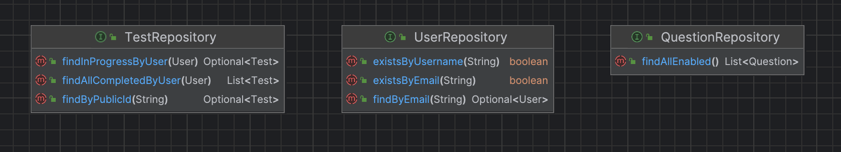

Repozytoria służą do pobierania danych z bazy danych.
W aplikacji są to klasy, które dziedziczą po `JpaRepository` z pakietu `org.springframework.data.jpa.repository`.

W repozytoriach napisane są zapytania w języku HQL (Oznaczone adnotacją `@Query` nad metodą).

### Kontrolery 

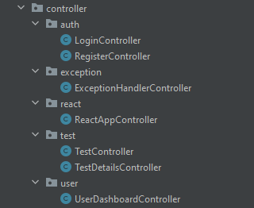

Kontrolery są podzielone na pakiety odpowiednio od części aplikacji.
Kontrolery służą do obsługi zapytań HTTP.


### Konwertery

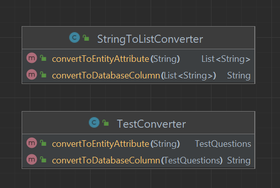

Konwertery służą do konwersji obiektów z i do formatu JSON, aby móc je zapisać do bazy danych.

### Wyjątki

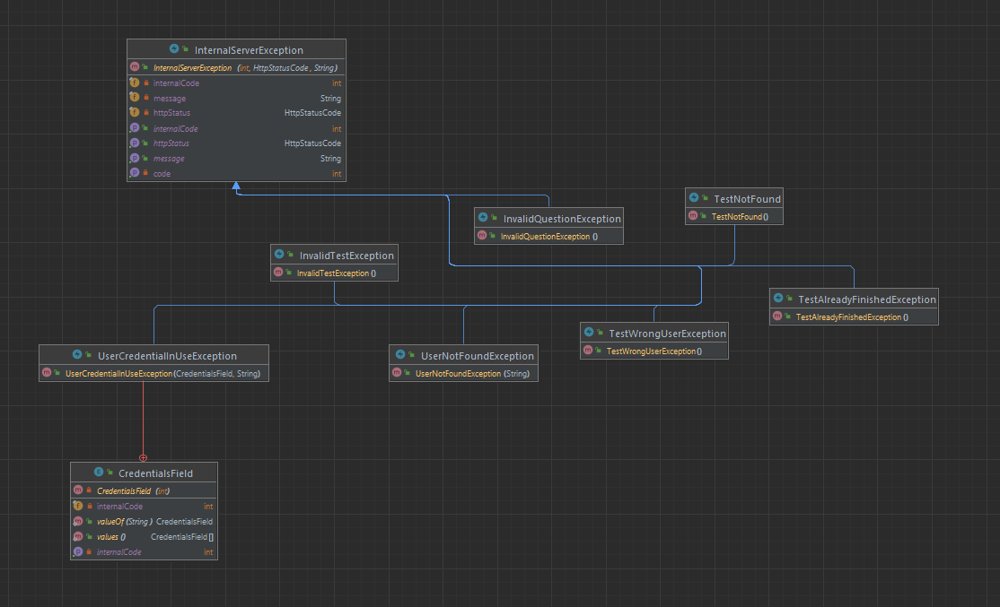

Wyjątki służą do obsługi błędów w aplikacji.
Klasa bazowa `InternalServerException` dziedziczy po `RuntimeException`.
Każdy z wyjątków dziedziczy po `InternalServerException`.
Wyjątki są rzucane, gdy wystąpi błąd w aplikacji, i obsługiwane w klasie `ExceptionHandlerController`,
która zwraca odpowiedni kod HTTP oraz wiadomość o błędzie.

### Spring Security

Aplikacja korzysta z mechanizmu Spring Security do autoryzacji użytkowników.

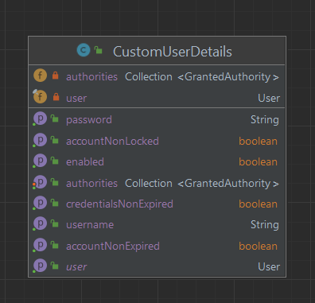

Klasa `CustomUserDetails` implementuje interfejs `UserDetails` z
pakietu `org.springframework.security.core.userdetails`.
zapisane są w niej dane użytkownika, takie jak login, hasło, role, czy konto jest aktywne (wymaga tego interfejs).

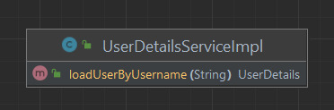

Klasa `UserDetailsServiceImpl` implementuje interfejs `UserDetailsService` z
pakietu `org.springframework.security.core.userdetails`.
Zawiera metodę `loadUserByUsername`, która zwraca obiekt klasy `CustomUserDetails` na podstawie loginu użytkownika.

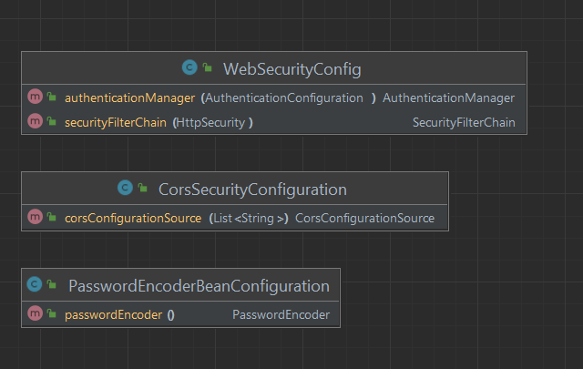

Klasy `WebSecurityConfig`, `PasswordEncoderBeanConfiguration` oraz `CorsSecurityConfiguration` odpowiednio konfigurują
mechanizmy Spring Security takie jak:

- konfiguracje bezpieczeństwa aplikacji (który endpoint wymaga autoryzacji, a który nie),
- konfiguracje hashowania haseł,
- konfiguracje CORS (Cross-Origin Resource Sharing).

### DTOs

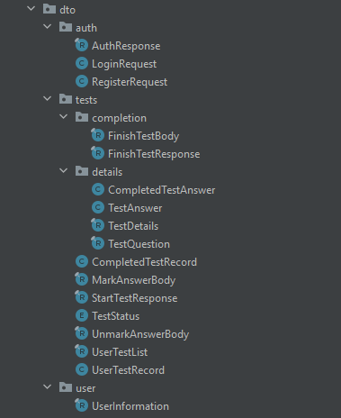

W paczce `dto` znajdują się klasy, które służą do przesyłania danych między frontendem a backendem.
Służą do tego klasy, które posiadają tylko pola, bez logiki biznesowej.
W klasie `CompletedTestAnswer` oraz `TestAnswer` zostało użyte dziedziczenie, aby uniknąć powtarzania się kodu.

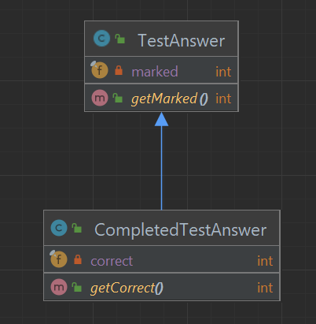

### Serwisy

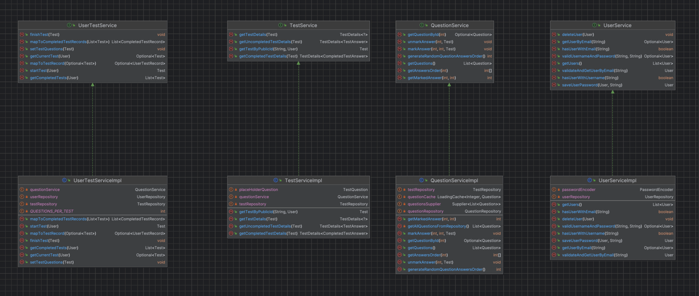

Serwisy służą do obsługi logiki biznesowej.
Każdy z serwisów implementuje interfejs, który zawiera metody do obsługi danych.

## Baza danych

Do projektu została użyta baza danych `MySQL`.

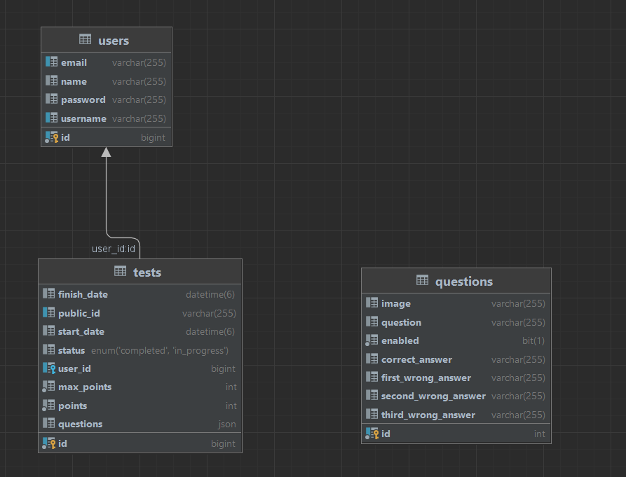

Tabela `questions` zawiera pytania i odpowiedzi. Jest traktowana jak tabela read-only.
Są z niej pobierane pytania do testu.

## Technologie

### Gradle


Gradle to nowoczesne narzędzie do automatyzacji budowania projektów programistycznych, które jest szczególnie popularne
w ekosystemie Java. Umożliwia on efektywne zarządzanie zależnościami oraz automatyzację procesów kompilacji, testowania
i wdrażania aplikacji.

### Spring Framework


Spring Framework to potężne i elastyczne narzędzie do tworzenia aplikacji Java, które ułatwia zarządzanie komponentami
poprzez mechanizmy wstrzykiwania zależności (Dependency Injection). Dzięki bogatemu ekosystemowi modułów, takich jak
Spring MVC do tworzenia aplikacji webowych czy Spring Data do pracy z bazami danych, umożliwia szybki rozwój
skalowalnych i wydajnych aplikacji enterprise.

### Github Copilot


GitHub Copilot to zaawansowane narzędzie wspomagające pisanie kodu, oparte na sztucznej inteligencji, które zostało
opracowane przez GitHub we współpracy z OpenAI.

### React


Frontend został stworzony przy pomocy biblioteki React.
React to biblioteka JavaScript, która jest używana do tworzenia interaktywnych interfejsów użytkownika (UI).
Została stworzona przez Facebooka i jest utrzymywana przez społeczność open-source.

## Uruchamianie
1. Pobierz projekt
2. Utwórz bazę danych SQL (bazę danych, użytkownika z hasłem)
3. Wejdź do pliku `./backend/resources/application.prod` i zmien `spring.profiles.active` na `dev` 
4. Wejdź do pliku `./backend/resources/application-dev.yml` i edytuj dane do polaczenia do bazy danych. Do `security.allowed-origins` będzie wymagane dopisanie nazwy hosta, na którym będzie uruchomiona aplikacja. (domyślnie `localhost:8080`)
5. W katalogu projektu wykonaj polecenie `.\gradlew buildprod` (Unix: `gradle buildprod`) Plik powinien znajdować się z folderze `./backend/libs/backend-0.0.1-SNAPSHOT.jar`
6. Skopiuj w/w plik do innego folderu
7. Uruchom program poleceniem:
```sh
java
    -Dspring.datasource.password=HASLO
    -Dspring.datasource.hikari.password=HASLO
    -Xmx2G -Xms512M
    -jar backend-0.0.1-SNAPSHOT.jar 
```

## Proces tworzenia

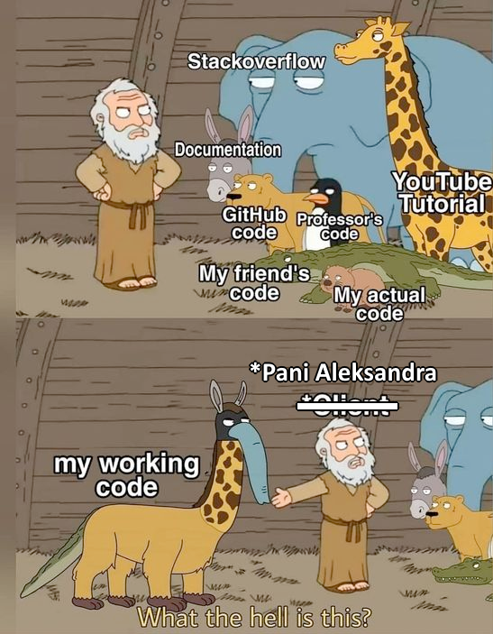

### Do zrobienia

-Strona głowna- dodać jakieś fotki, ewentualnie 

-Dodać pytania testowe, plus jakieś fotki do nich

-Więcej struktury i metod obiektówki w dokumentacji 

-paradygmat obiektowy

-"nieobowiązkowe" dokładanie obiektówki do kodu - na moodle mają pojawić się zadania z tego
